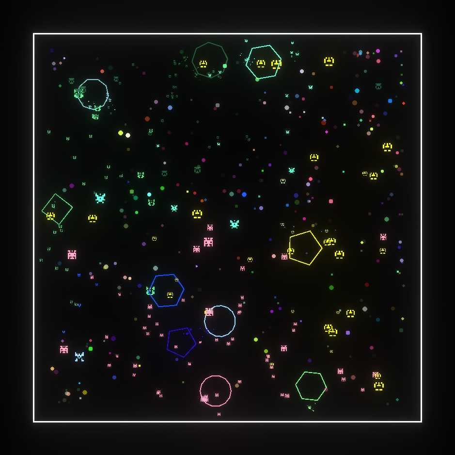
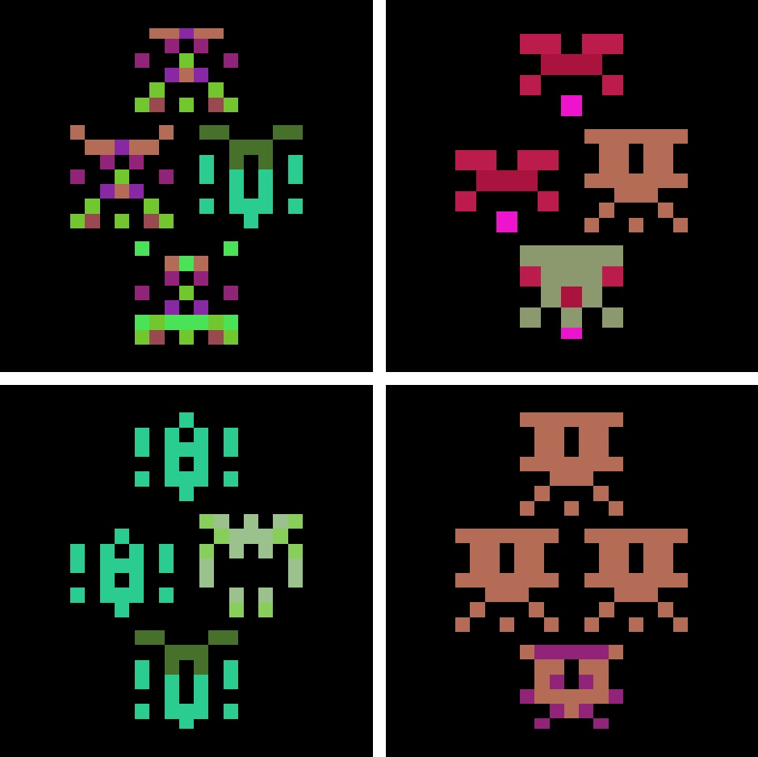
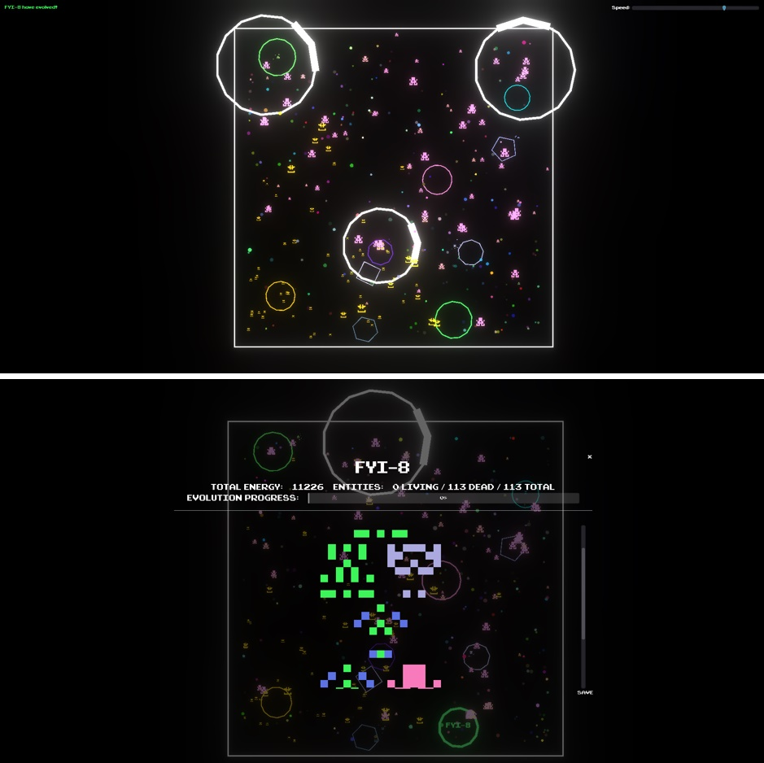

 

	<a>
		
		<h1 align="center">
			Tribes-Evolved
		</h1>
	</a>

	
	

> 2D procedural evolutionary simulation, made in Godot

---

	<h1> Fully procedural maps </h1>
	
	<h1> Fully procedural entities and evolutions </h1>
	
	<h1> Interactive world </h1>
	

